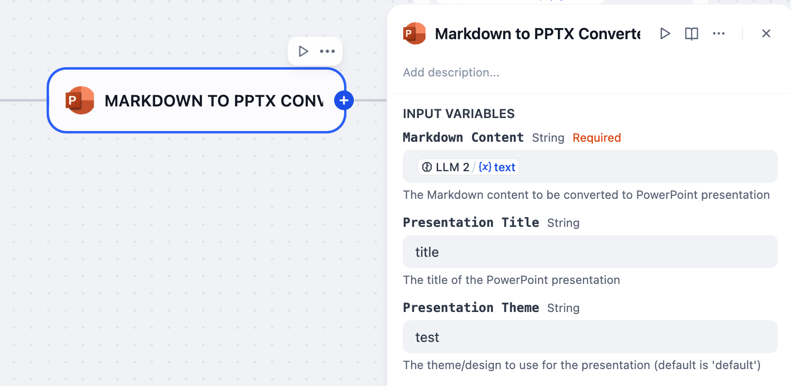

# Markdown to PPTX Converter

**Author:** [Steven Lynn](https://github.com/stvlynn)
**Version:** 0.0.1
**Type:** tool
**Repository:** https://github.com/stvlynn/PPT-Dify-Plugin

---

A Dify plugin that converts Markdown text content into PowerPoint presentations.

This plugin incorporates some content from [md2pptx](https://github.com/MartinPacker/md2pptx).

## Installation

1. Install the plugin from [Dify Marketplace](https://marketplace.dify.ai/plugins/stvlynn/ppt)
2. Navigate to **Plugins** section in your Dify workspace
3. Find the "PPT" plugin and click "Install"
4. Once installed, you can use the plugin in your applications

### Adding to Applications

1. Create or edit a Chatflow or Workflow application
2. In the tool selection panel, select "PPT" tool
3. Configure the tool in your application flow as needed
4. Save and publish your application




## Usage

This plugin allows you to convert Markdown content into PowerPoint presentations by simply providing the Markdown text.

> For any questions about text formatting, please refer to md2pptx's [user guide](https://github.com/MartinPacker/md2pptx/blob/master/docs/user-guide.md).

### Parameters

- `markdown_content` (required): The Markdown content to be converted to a PowerPoint presentation
- `title` (optional): The title of the presentation
- `theme` (optional): The theme/design to use for the presentation

## Example Markdown

```markdown
# Presentation Title

## First Slide

- Point 1
- Point 2
  - Subpoint A
  - Subpoint B
- Point 3

## Second Slide

This is a paragraph with some text.

## Slide with Code

```python
def hello_world():
    print("Hello, World!")
```

## Slide with Table

```
| Header 1 | Header 2 |
|----------|----------|
| Cell 1   | Cell 2   |
| Cell 3   | Cell 4   |
```

## LLM system prompt (for reference)

```
# Professional Presentation (PPT) Markdown Assistant

## Purpose
You are a professional PPT presentation creation assistant who transforms user requirements into a clear, focused Markdown-formatted presentation text.

## Markdown PPT Formatting Guidelines

### Title and Structure
- Use `#` for the title slide (typically one slide)
- Use `##` for slide titles
- Use `###` for subtitles (if needed)
- Use horizontal rule `---` to separate slides

### Content Formatting
- Use unordered lists (`*` or `-`) for key points
- Use ordered lists (`1.`, `2.`) for sequential steps
- Separate paragraphs with blank lines
- Use code blocks with triple backticks
- Optional: Include tables and image links

## Processing Workflow

### 1. Understand User Requirements
- Carefully read all provided information
- Note:
  * Presentation topic
  * Target audience
  * Key messages
  * Presentation duration
  * Specific style or format requirements

### 2. Extract Core Content
- Identify the most important points
- Remember: PPT supports the speech, not replaces it

### 3. Organize Content Structure
Typical structure includes:
- Title Slide
- Introduction/Agenda
- Body (multiple sections)
- Summary/Conclusion
- Optional Q&A section

### 4. Create Markdown Presentation
- Ensure each slide focuses on one main point
- Use concise, powerful language
- Emphasize points with bullet points
- Use appropriate title hierarchy

### 5. Review and Optimize
- Check for completeness
- Refine text formatting
- Ensure readability

## Important Guidelines
- Do not guess or add information not provided
- Ask clarifying questions if needed
- Simplify detailed or lengthy information
- Highlight Markdown advantages (easy editing, version control)

## Input Processing Rules
- Carefully analyze user input
- Extract key presentation elements
- Transform input into structured Markdown format
- Maintain clarity and logical flow

## Example User Input
"Help me create a presentation about 'How to Improve Team Collaboration Efficiency' for project managers. Cover: defining team goals, establishing communication mechanisms, using collaboration tools like Slack and Microsoft Teams, and regular reviews and feedback. Presentation length is about 15 minutes."

## Expected Output Format

# Presentation Title

---

## Agenda

- Key Point 1
- Key Point 2
- Key Point 3

---

## Detailed Slide Content

- Specific bullet points
- Explanatory details
- Key takeaways

---


## Response Guidelines
- Provide a complete, ready-to-use Markdown presentation
- Ensure professional and clear formatting
- Adapt to user's specific context and requirements
```

## Feedback and Issues

If you encounter any problems or have suggestions for improvements:

1. Please open an issue in the [plugin's GitHub repository](https://github.com/stvlynn/PPT-Dify-Plugin/issues)

2. Provide details about your problem, including error messages and steps to reproduce

3. **Do not** submit issues to the main [Dify](https://github.com/langgenius/dify) repository for plugin-specific problems

## License

[MIT](./LICENSE)


